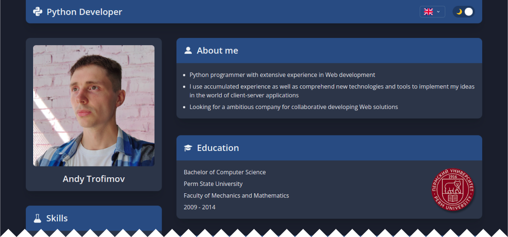

# CV: Python Developer

My CV built with [React](https://github.com/facebook/react) and [Chakra UI](https://github.com/chakra-ui/chakra-ui).

You can use it for your own purposes, just replace your resume in `src/locales/*.json` files and probably you would want your own icons in `src/icons` and meta data in `src/index.html`.

 

  

